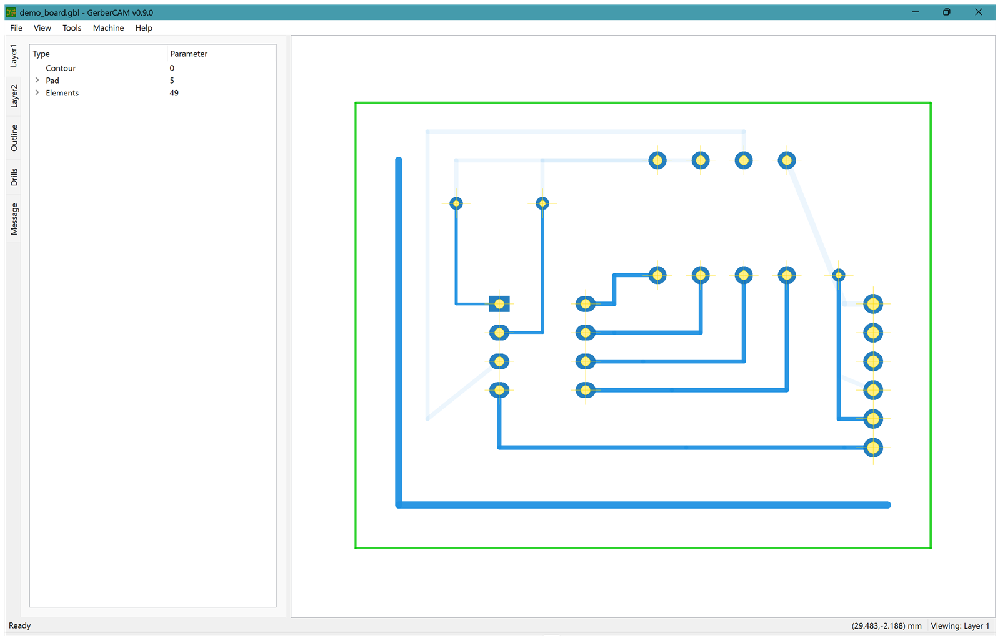
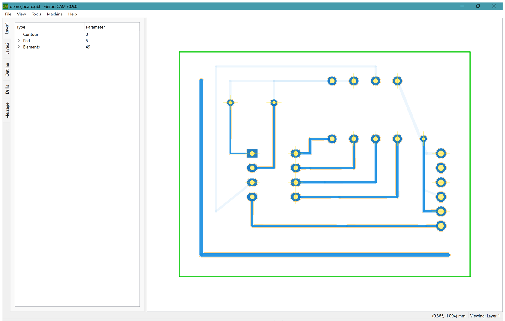
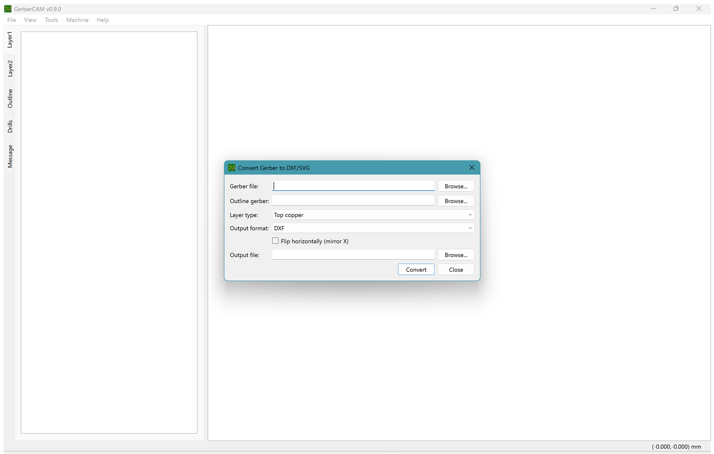
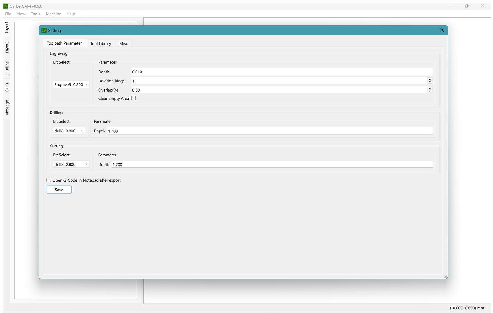

> [!NOTE]
> From: @computergeek1507
> 
> Current State:
>  * Forked @claus007 version
>  * Switched to cMake
>  * Compiles with VS2022 and QT 6.6 (QT 5.15 still works too).
>  * Update gerber parser to support macros used in Kicad 9.
>  * Updated DrawPCB and Toolpath code to work I hope.
>  * Add Excellon Parser.
>  * Add Outline Gerber support.
>  * Add Flipping for single side.
>  * Add Gcode Export for Toolpaths, Outline, Drill Holes.
>  * Add Drill Hole Gcode Export with Boring support.
>  * Add Full Copper Clearing.
>  * Add Project Save/Load.
>  * Add "Open Gerber Folder" to auto-find top, bottom, outline, and drill files.
>  * Add DXF and SVG Export (separate top copper, bottom copper, outline, and drill files).
>  * Add command line loading and batch export (`GerberCAM <folder> --export-gcode base --quit`).
>  * Add spdlog and nlohmann json.
>  * Add Installer script and GitHub Action.
>
> See [CHANGELOG.md](CHANGELOG.md) for details.

# GerberCAM
**What is GerberCAM?**  
GerberCAM is an opensource software to convert a PCB gerber file to a CNC machine manufacture file (G-code). The following picture shows GerberCAM’s role in PCB prototyping process.

**What are the features of GerberCAM?**  
GerberCAM currently support following features.  
● Recieve gerber file in RS-274X format only  
● Up to two layers(top & bottom)  
● Pad holes automatic recognition  
● Tool bits (drill, conical, cylindrical) generation & management  

Contour path:  
    ● Automatically treat closed loop as contour path  
    ● Can determine contour path by thresholds  

Toolpath generating:  
    ● Single bit toolpath  
    ● Automatically DRC and show the collided path  

Pad types:  
    ● pads with rotation  
    ● Round  
    ● Rectangle  
    ● Obround  
    ● Teardrop(● Track   ● Arc)  
    
Track types:  
    ● straight line  

Import:  
    ● RS-274X gerber (top/bottom copper, outline/edge cuts)  
    ● Excellon drill files  
    ● Open Gerber Folder (auto-detects top, bottom, outline, and drill files)  
    ● Project save/load (.gcproj)  

Export:  
    ● G-code: isolation toolpaths, copper clearing, outline cutting, drilling (with optional boring)  
    ● DXF: separate files for top copper, bottom copper, outline, and drills  
    ● SVG: same file set, true-scale in millimetres  
    ● Convert Gerber to DXF/SVG dialog for single files (copper, silkscreen, or solder mask, with optional outline)  

Command line:  
    ● `GerberCAM <gerber folder>` or `GerberCAM <project.gcproj>` to load on startup  
    ● `--folder` / `--project` / `--top` / `--bottom` / `--outline` / `--drill` to load explicitly  
    ● `--export-gcode <base>`, `--export-dxf <base>`, `--export-svg <base>` for batch export  
    ● `--flip` to mirror X, `--quit` to exit after exporting (scripted use)  
  
**Here are the snapshots of the current development.**

Board view (two copper layers, outline, and drills):

Generated isolation toolpaths:

Gerber to DXF/SVG converter:

Settings:

GerberCAM is still a prototype. After three months of heavy development and testing it’s suspended. It has a fast generation time comparing to CopperCAM 2012, which is the CAM software I’ve been using to generate G-code for PCB prototyping for years. It can also handle some PCBs which can’t be supported by CopperCAM.  

However, since I don’t have a CNC machine to test the software anymore so I didn’t continue to work on this project. I’ve been using hundreds of gerber files and thousands of times to test all current functions. There are still a lot of testing and verification work to do in the future. If anyone is interested in this project, feel free to fork it. There are several opensource CAM software projects out there and I hope my works could contribute any help.  

